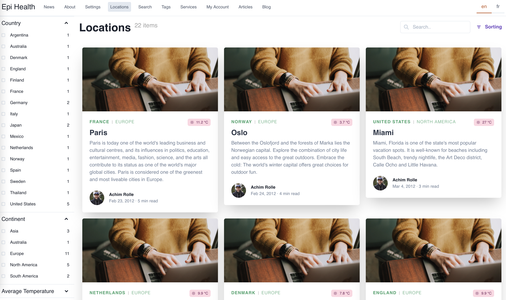
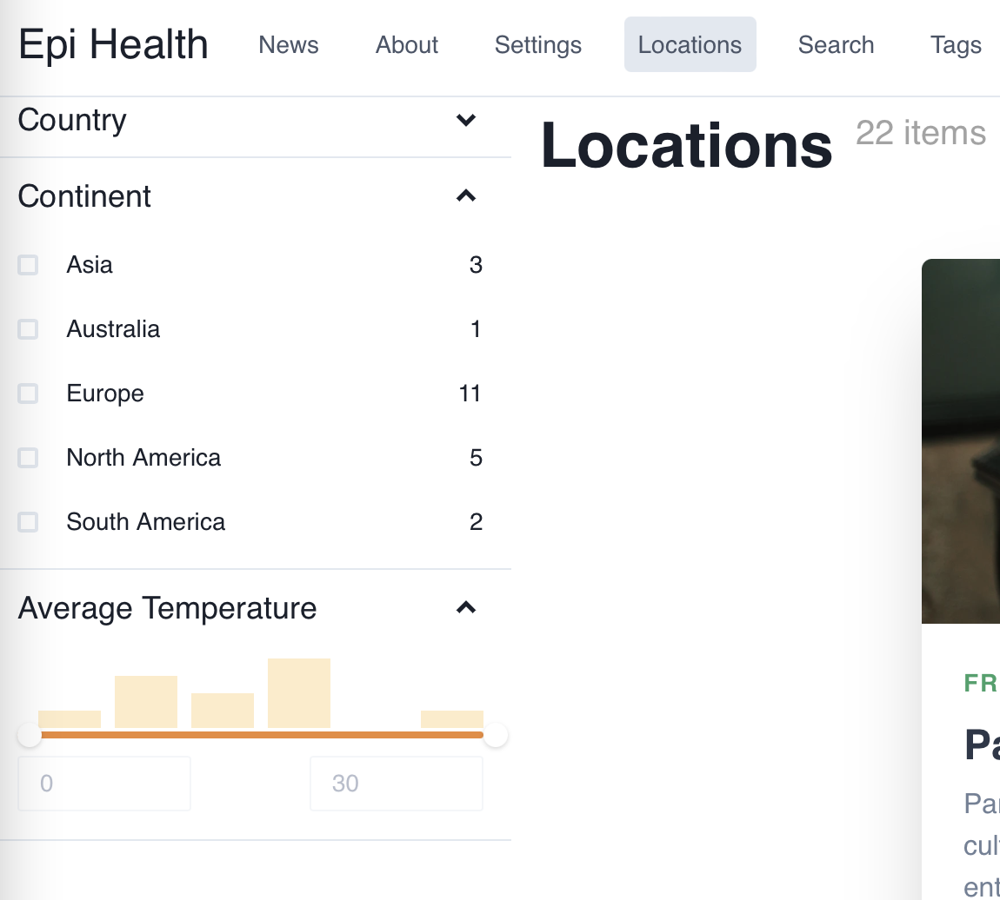

# I. What does location page look like?

We are going to create a single page like the below figure:



# II. How to do it?
Here are the steps to do:

1. Query all location list pages.
2. Query all location items of each location page.
3. Get facets of `Country`, `Continents` and `AverageTemperature`
4. Create `LocationListPage` component



# III. Let's do it.

1. Query all location list pages

``` graphql
query LocationListQuery(
  $locale: [Locale] = [EN]
  $path: String
  $continents: [String] = []
  $countries: [String] = []
  $minAvgTemp: Float = 0
  $maxAvgTemp: Float = 30
  $orderBy: LocationItemPageOrderByInput
  $searchTerm: String = ""
) {
  LocationListPage(
    locale: $locale, 
    where: { RelativePath: { eq: $path } }) {
    items {
      Name
      MainBody
    }
  }
}

```

2. Query all location items of each location page.

```graphql
query LocationListQuery(
  $locale: [Locale] = [EN]
  $path: String
  $continents: [String] = []
  $countries: [String] = []
  $minAvgTemp: Float = 0
  $maxAvgTemp: Float = 30
  $orderBy: LocationItemPageOrderByInput
  $searchTerm: String = ""
) {
  LocationListPage(
    locale: $locale, 
    where: { RelativePath: { eq: $path } }) {
    items {
      Name
      MainBody
      _children {
        LocationItemPage(
          limit: 100
          where: {
            AvgTemp: { gte: $minAvgTemp, lte: $maxAvgTemp }
            Country: { in: $countries }
            Continent: { in: $continents }
            _fulltext: { like: $searchTerm }
          }
          orderBy: $orderBy
        ) {
          total
          items {
            Location: Name
            Country
            Continent
            Created
            AvgTemp
            Longitude
            Latitude
            IntroText: MainIntro
            RelativePath
          }
        }
      }
    }
  }
}

```

3. Refactor: move all fields under `LocationItemPage` items to a fragment.

```graphql
fragment LocationItemFragment on LocationItemPage {
  Location: Name
  Country
  Continent
  Created
  AvgTemp
  Longitude
  Latitude
  IntroText: MainIntro
  RelativePath
}
```
The new code should be:
```graphql
#import "./fragments/LocationItemFragment.gql"

query LocationListQuery(
  $locale: [Locale] = [EN]
  $path: String
  $continents: [String] = []
  $countries: [String] = []
  $minAvgTemp: Float = 0
  $maxAvgTemp: Float = 30
  $orderBy: LocationItemPageOrderByInput
  $searchTerm: String = ""
) {
  LocationListPage(
    locale: $locale, 
    where: { RelativePath: { eq: $path } }) {
    items {
      Name
      MainBody
      _children {
        LocationItemPage(
          limit: 100
          where: {
            AvgTemp: { gte: $minAvgTemp, lte: $maxAvgTemp }
            Country: { in: $countries }
            Continent: { in: $continents }
            _fulltext: { like: $searchTerm }
          }
          orderBy: $orderBy
        ) {
          total
          items {
            ...LocationItemFragment
          }
        }
      }
    }
  }
}
```
4. Get facets of `Country`, `Continent` and `AverageTemperature` for `LocationItemPage`.

```graphql
#import "./fragments/LocationItemFragment.gql"

query LocationListQuery(
  $locale: [Locale] = [EN]
  $path: String
  $continents: [String] = []
  $countries: [String] = []
  $minAvgTemp: Float = 0
  $maxAvgTemp: Float = 30
  $orderBy: LocationItemPageOrderByInput
  $searchTerm: String = ""
) {
  LocationListPage(locale: $locale, where: { RelativePath: { eq: $path } }) {
    items {
      Name
      MainBody
      _children {
        LocationItemPage(
          limit: 100
          where: {
            AvgTemp: { gte: $minAvgTemp, lte: $maxAvgTemp }
            Country: { in: $countries }
            Continent: { in: $continents }
            _fulltext: { like: $searchTerm }
          }
          orderBy: $orderBy
        ) {
          total
          items {
            ...LocationItemFragment
          }
          facets {
            Country(orderType: VALUE, orderBy: ASC, limit: 100) {
              name
              count
            }
            Continent(orderType: VALUE, orderBy: ASC) {
              name
              count
            }
            AverageTemperature: AvgTemp(
              ranges: [
                { from: 0, to: 5 }
                { from: 5, to: 10 }
                { from: 10, to: 15 }
                { from: 15, to: 20 }
                { from: 20, to: 25 }
                { from: 25, to: 30 }
              ]
            ) {
              name
              count
            }
          }
        }
      }
    }
  }
}

```

The above query returns the below data:
```json
{
    "data": {
        "LocationListPage": {
            "items": [
                {
                    "Name": "Locations",
                    "MainBody": "",
                    "_children": {
                        "LocationItemPage": {
                            "total": 22,
                            "items": [
                                {
                                    "Location": "Paris",
                                    "Country": "France",
                                    "Continent": "Europe",
                                    "Created": "2012-02-23T09:16:00Z",
                                    "AvgTemp": 11.2,
                                    "Longitude": 2.3508,
                                    "Latitude": 48.8567,
                                    "IntroText": "Paris is today one of the world's leading business and cultural centres, and its influences in politics, education, entertainment, media, fashion, science, and the arts all contribute to its status as one of the world's major global cities. Paris is considered one of the greenest and most liveable cities in Europe.",
                                    "RelativePath": "/en/locations/Paris",
                                    "__typename": "LocationItemPage"
                                },
                                {
                                    "Location": "Oslo",
                                    "Country": "Norway",
                                    "Continent": "Europe",
                                    "Created": "2012-02-24T08:28:00Z",
                                    "AvgTemp": 3.7,
                                    "Longitude": 10.756389,
                                    "Latitude": 59.949444,
                                    "IntroText": "Between the Oslofjord and the forests of Marka lies the Norwegian capital. Explore the combination of city life and easy access to the great outdoors. Embrace the cold: The world's winter capital offers great choices for outdoor fun.",
                                    "RelativePath": "/en/locations/Oslo",
                                    "__typename": "LocationItemPage"
                                },
                                {
                                    "Location": "Miami",
                                    "Country": "United States",
                                    "Continent": "North America",
                                    "Created": "2012-03-03T19:53:00Z",
                                    "AvgTemp": 27,
                                    "Longitude": -80.224145,
                                    "Latitude": 25.787676,
                                    "IntroText": "Miami, Florida is one of the state's most popular vacation spots. It is well-known for beaches including South Beach, trendy nightlife, the Art Deco district, Calle Ocho and Little Havana.",
                                    "RelativePath": "/en/locations/Miami",
                                    "__typename": "LocationItemPage"
                                },
                                {
                                    "Location": "Amsterdam",
                                    "Country": "Netherlands",
                                    "Continent": "Europe",
                                    "Created": "2012-02-23T16:01:00Z",
                                    "AvgTemp": 9.9,
                                    "Longitude": 4.892222,
                                    "Latitude": 52.373056,
                                    "IntroText": "Amsterdam is one of the most popular tourist destinations in Europe, receiving more than 4.63 million international visitors annually. The number of visitors has been growing steadily over the past decade. The city is also cultural capital of the Netherlands.",
                                    "RelativePath": "/en/locations/Amsterdam",
                                    "__typename": "LocationItemPage"
                                },
                                {
                                    "Location": "Copenhagen",
                                    "Country": "Denmark",
                                    "Continent": "Europe",
                                    "Created": "2012-03-03T18:07:00Z",
                                    "AvgTemp": 7.8,
                                    "Longitude": 12.568333,
                                    "Latitude": 55.676111,
                                    "IntroText": "Copenhagen, the premier capital of Northern Europe, is Scandinavia's most fantastic city and the centre of the most dynamic region in Europe, the Øresund Region. The city is one of Europe's oldest capitals with a royal touch - the monarchy in Denmark is the oldest in the world! ",
                                    "RelativePath": "/en/locations/Copenhagen",
                                    "__typename": "LocationItemPage"
                                },
                                {
                                    "Location": "London",
                                    "Country": "England",
                                    "Continent": "Europe",
                                    "Created": "2012-02-23T08:40:00Z",
                                    "AvgTemp": 9.9,
                                    "Longitude": -0.1275,
                                    "Latitude": 51.507222,
                                    "IntroText": "London is a leading global city, with strengths in the arts, commerce, education, entertainment, fashion, finance, healthcare, media, professional services, research and development, tourism and transport all contributing to its prominence. London has a diverse range of peoples, cultures, and religions, and more than 300 languages are spoken within its boundaries.",
                                    "RelativePath": "/en/locations/London",
                                    "__typename": "LocationItemPage"
                                },
                                {
                                    "Location": "Helsinki",
                                    "Country": "Finland",
                                    "Continent": "Europe",
                                    "Created": "2012-02-24T10:52:00Z",
                                    "AvgTemp": 4.5,
                                    "Longitude": 24.9375,
                                    "Latitude": 60.170833,
                                    "IntroText": "Helsinki, Finland's capital city is a beautiful European destination, bursting at the seams with history, natural beauty and friendly people. On the one hand, it's metropolitan; on the other, the delightfully provincial countryside is not far away. There are lots of reasons to add Helsinki to your list of must-see destinations.",
                                    "RelativePath": "/en/locations/Helsinki",
                                    "__typename": "LocationItemPage"
                                },
                                {
                                    "Location": "New York",
                                    "Country": "United States",
                                    "Continent": "North America",
                                    "Created": "2012-02-23T09:23:00Z",
                                    "AvgTemp": 16.8,
                                    "Longitude": -74,
                                    "Latitude": 40.716667,
                                    "IntroText": "Many districts and landmarks in New York City have become well known to its approximately 50 million annual visitors. Times Square is the brightly illuminated hub of the Broadway theater district, one of the world's busiest pedestrian intersections, and a major center of the world's entertainment industry. The city hosts many world renowned bridges, skyscrapers, and parks. ",
                                    "RelativePath": "/en/locations/New-York",
                                    "__typename": "LocationItemPage"
                                },
                                {
                                    "Location": "Berlin",
                                    "Country": "Germany",
                                    "Continent": "Europe",
                                    "Created": "2012-02-23T09:20:00Z",
                                    "AvgTemp": 8.9,
                                    "Longitude": 13.398889,
                                    "Latitude": 52.500556,
                                    "IntroText": "Berlin is a world city of culture, politics, media, and science. Its economy is primarily based on the service sector, encompassing a diverse range of creative industries, media corporations, and convention venues. Berlin also serves as a continental hub for air and rail transport, and is a popular tourist destination.",
                                    "RelativePath": "/en/locations/Berlin",
                                    "__typename": "LocationItemPage"
                                },
                                {
                                    "Location": "Osaka",
                                    "Country": "Japan",
                                    "Continent": "Asia",
                                    "Created": "2012-03-03T20:07:00Z",
                                    "AvgTemp": 15.4,
                                    "Longitude": 135.502222,
                                    "Latitude": 34.693889,
                                    "IntroText": "If Tokyo is Japan's capital, one might call Osaka its anti-capital. Whatever you call it, though, there are many opportunities for you to discover its true character. Be sure to visit the Osaka Castle, Osaka's best known sight, and the Osaka Science Museum with its interactive activity center which the kids will love!",
                                    "RelativePath": "/en/locations/Osaka",
                                    "__typename": "LocationItemPage"
                                },
                                {
                                    "Location": "San Francisco",
                                    "Country": "United States",
                                    "Continent": "North America",
                                    "Created": "2012-02-23T09:28:00Z",
                                    "AvgTemp": 13.8,
                                    "Longitude": -122.4192,
                                    "Latitude": 37.7793,
                                    "IntroText": "San Francisco is one of the top tourist destinations in the world, ranking 33rd out of the 100 most visited cities worldwide, and is renowned for its chilly summer fog, steep rolling hills, eclectic mix of architecture, and its famous landmarks, including the Golden Gate Bridge, cable cars, and Chinatown.",
                                    "RelativePath": "/en/locations/San-Francisco",
                                    "__typename": "LocationItemPage"
                                },
                                {
                                    "Location": "Stockholm",
                                    "Country": "Sweden",
                                    "Continent": "Europe",
                                    "Created": "2012-02-23T16:45:00Z",
                                    "AvgTemp": 5.8,
                                    "Longitude": 18.068611,
                                    "Latitude": 59.329444,
                                    "IntroText": "If you ask someone who has visited Stockholm the first word they would probably use to describe it is “beautiful”, and that it is. Stockholm is a major international city with great shopping, quality eateries in abundance, fabulous standard hotels, an internationally renowned club and music scene and a vibrant cultural life. Where Stockholm comes into its own, however, is its sheer natural beauty.",
                                    "RelativePath": "/en/locations/Stockholm",
                                    "__typename": "LocationItemPage"
                                },
                                {
                                    "Location": "Sydney",
                                    "Country": "Australia",
                                    "Continent": "Australia",
                                    "Created": "2012-02-23T16:13:00Z",
                                    "AvgTemp": 17.6,
                                    "Longitude": 151.211111,
                                    "Latitude": -33.859972,
                                    "IntroText": "Sydney is one of the busiest commercial hubs in the Asia-Pacific region with a cosmopolitan population, many historic sites, museums and parks. Sydney’s city centre offers visitors a huge variety of attractions, including designer boutiques, fine restaurants, hip bars and lavish department stores.",
                                    "RelativePath": "/en/locations/Sydney",
                                    "__typename": "LocationItemPage"
                                },
                                {
                                    "Location": "Rome",
                                    "Country": "Italy",
                                    "Continent": "Europe",
                                    "Created": "2012-02-24T08:28:00Z",
                                    "AvgTemp": 15,
                                    "Longitude": 12.5,
                                    "Latitude": 41.9,
                                    "IntroText": "The \"Eternal city\", Rome is not only represented by its masterpieces of art, and breathtaking architecture, monuments and museums but by its typical streets and alleyways where one can discover traits of Italian lifestyle, tradition and culture.",
                                    "RelativePath": "/en/locations/Rome",
                                    "__typename": "LocationItemPage"
                                },
                                {
                                    "Location": "Barcelona",
                                    "Country": "Spain",
                                    "Continent": "Europe",
                                    "Created": "2012-02-23T15:59:00Z",
                                    "AvgTemp": 16.2,
                                    "Longitude": 2.183333,
                                    "Latitude": 41.383333,
                                    "IntroText": "Visitors come to Barcelona for its beaches, nightlife, events, and outdoor activities such as hiking, biking, sunbathing, and sightseeing. The most popular time to visit is during the summer, when schools are on vacation and the weather is hot. In the spring, fewer people visit and temperatures are cooler than summer.",
                                    "RelativePath": "/en/locations/Barcelona",
                                    "__typename": "LocationItemPage"
                                },
                                {
                                    "Location": "Mexico City",
                                    "Country": "Mexico",
                                    "Continent": "South America",
                                    "Created": "2012-03-11T18:34:00Z",
                                    "AvgTemp": 15.9,
                                    "Longitude": -99.133333,
                                    "Latitude": 19.433333,
                                    "IntroText": "In Mexico City, travelers can admire on the same landscape beautiful buildings from several centuries ago and the most avant-garde architectural offerings; the traveler can also taste traditional flavors kept hidden in street markets, or have a delight with dishes prepared by internationally renowned chefs.",
                                    "RelativePath": "/en/locations/Mexico-City",
                                    "__typename": "LocationItemPage"
                                },
                                {
                                    "Location": "Buenos Aires",
                                    "Country": "Argentina",
                                    "Continent": "South America",
                                    "Created": "2012-03-11T18:56:00Z",
                                    "AvgTemp": 16.6,
                                    "Longitude": -58.381667,
                                    "Latitude": -34.603333,
                                    "IntroText": "Buenos Aires is the capital of the Republic of Argentina and the country's largest city. Located in front of the Río de La Plata, it is a modern, dynamic and radiant city that features the European architecture of its founders and absorbs the passion of its people; the \"Porteños\" (people of the port).",
                                    "RelativePath": "/en/locations/Buenos-Aires",
                                    "__typename": "LocationItemPage"
                                },
                                {
                                    "Location": "Tokyo",
                                    "Country": "Japan",
                                    "Continent": "Asia",
                                    "Created": "2012-03-03T20:06:00Z",
                                    "AvgTemp": 14.5,
                                    "Longitude": 139.6917,
                                    "Latitude": 35.689506,
                                    "IntroText": "Tokyo offers a seemingly unlimited choice of shopping, entertainment, culture and dining to its visitors. The city's history can be appreciated in districts such as Asakusa, and in many excellent museums, historic temples and gardens. Contrary to common perception, Tokyo also offers a number of attractive green spaces in the city center and within relatively short train rides at its outskirts",
                                    "RelativePath": "/en/locations/Tokyo",
                                    "__typename": "LocationItemPage"
                                },
                                {
                                    "Location": "Munich",
                                    "Country": "Germany",
                                    "Continent": "Europe",
                                    "Created": "2012-03-03T19:42:00Z",
                                    "AvgTemp": 9.9,
                                    "Longitude": 11.566667,
                                    "Latitude": 48.133333,
                                    "IntroText": "Munich, located at the river Isar in the south of Bavaria, is famous for its beautiful architecture, fine culture, and the annual Oktoberfest beer celebration. Munich's cultural scene is second to none in Germany, with the museums even considered by some to outrank Berlin in quality. Many travelers to Munich are absolutely stunned by the quality of the architecture.",
                                    "RelativePath": "/en/locations/Munich",
                                    "__typename": "LocationItemPage"
                                },
                                {
                                    "Location": "Chicago",
                                    "Country": "United States",
                                    "Continent": "North America",
                                    "Created": "2012-03-03T19:52:00Z",
                                    "AvgTemp": 14.7,
                                    "Longitude": -87.627778,
                                    "Latitude": 41.881944,
                                    "IntroText": "Few cities in the world can match the character and culture of Chicago. Whether you're visiting for business or pleasure, you can expect to find world-class dining, museums, entertainment and accommodations here in the largest and most visited city in the Midwest.",
                                    "RelativePath": "/en/locations/Chicago",
                                    "__typename": "LocationItemPage"
                                },
                                {
                                    "Location": "Los Angeles",
                                    "Country": "United States",
                                    "Continent": "North America",
                                    "Created": "2012-03-03T20:08:00Z",
                                    "AvgTemp": 17.5,
                                    "Longitude": -118.25,
                                    "Latitude": 34.05,
                                    "IntroText": "The question in Los Angeles is never what to do, but where to begin. The county is home to many famous attractions in a relatively concentrated space. Your choices include amusement parks, architectural landmarks, art museums and galleries, beaches, parks, hiking and shopping, to name a few. After the sun goes down, you’ll find there’s an abundance of nightlife options.",
                                    "RelativePath": "/en/locations/Los-Angeles",
                                    "__typename": "LocationItemPage"
                                },
                                {
                                    "Location": "Bangkok",
                                    "Country": "Thailand",
                                    "Continent": "Asia",
                                    "Created": "2012-03-11T20:27:00Z",
                                    "AvgTemp": 28.1,
                                    "Longitude": 100.2938,
                                    "Latitude": 13.458,
                                    "IntroText": "Cultural phenomenon, shopping heaven and tourist treasure. Welcome to Bangkok; one of the most cosmopolitan, contrasting and, above all, compelling of Asian cities. A steamy, pulsating, yet smiling metropolis of more than ten million – intense at first, but addictive as anything.",
                                    "RelativePath": "/en/locations/Bangkok",
                                    "__typename": "LocationItemPage"
                                }
                            ],
                            "facets": {
                                "Country": [
                                    {
                                        "name": "Argentina",
                                        "count": 1,
                                        "__typename": "StringFacet"
                                    },
                                    {
                                        "name": "Australia",
                                        "count": 1,
                                        "__typename": "StringFacet"
                                    },
                                    {
                                        "name": "Denmark",
                                        "count": 1,
                                        "__typename": "StringFacet"
                                    },
                                    {
                                        "name": "England",
                                        "count": 1,
                                        "__typename": "StringFacet"
                                    },
                                    {
                                        "name": "Finland",
                                        "count": 1,
                                        "__typename": "StringFacet"
                                    },
                                    {
                                        "name": "France",
                                        "count": 1,
                                        "__typename": "StringFacet"
                                    },
                                    {
                                        "name": "Germany",
                                        "count": 2,
                                        "__typename": "StringFacet"
                                    },
                                    {
                                        "name": "Italy",
                                        "count": 1,
                                        "__typename": "StringFacet"
                                    },
                                    {
                                        "name": "Japan",
                                        "count": 2,
                                        "__typename": "StringFacet"
                                    },
                                    {
                                        "name": "Mexico",
                                        "count": 1,
                                        "__typename": "StringFacet"
                                    },
                                    {
                                        "name": "Netherlands",
                                        "count": 1,
                                        "__typename": "StringFacet"
                                    },
                                    {
                                        "name": "Norway",
                                        "count": 1,
                                        "__typename": "StringFacet"
                                    },
                                    {
                                        "name": "Spain",
                                        "count": 1,
                                        "__typename": "StringFacet"
                                    },
                                    {
                                        "name": "Sweden",
                                        "count": 1,
                                        "__typename": "StringFacet"
                                    },
                                    {
                                        "name": "Thailand",
                                        "count": 1,
                                        "__typename": "StringFacet"
                                    },
                                    {
                                        "name": "United States",
                                        "count": 5,
                                        "__typename": "StringFacet"
                                    }
                                ],
                                "Continent": [
                                    {
                                        "name": "Asia",
                                        "count": 3,
                                        "__typename": "StringFacet"
                                    },
                                    {
                                        "name": "Australia",
                                        "count": 1,
                                        "__typename": "StringFacet"
                                    },
                                    {
                                        "name": "Europe",
                                        "count": 11,
                                        "__typename": "StringFacet"
                                    },
                                    {
                                        "name": "North America",
                                        "count": 5,
                                        "__typename": "StringFacet"
                                    },
                                    {
                                        "name": "South America",
                                        "count": 2,
                                        "__typename": "StringFacet"
                                    }
                                ],
                                "AverageTemperature": [
                                    {
                                        "name": "[,5)",
                                        "count": 2,
                                        "__typename": "NumberFacet"
                                    },
                                    {
                                        "name": "[5,10)",
                                        "count": 6,
                                        "__typename": "NumberFacet"
                                    },
                                    {
                                        "name": "[10,15)",
                                        "count": 4,
                                        "__typename": "NumberFacet"
                                    },
                                    {
                                        "name": "[15,20)",
                                        "count": 8,
                                        "__typename": "NumberFacet"
                                    },
                                    {
                                        "name": "[20,25)",
                                        "count": 0,
                                        "__typename": "NumberFacet"
                                    },
                                    {
                                        "name": "[25,30)",
                                        "count": 2,
                                        "__typename": "NumberFacet"
                                    }
                                ],
                                "__typename": "LocationItemPageFacet"
                            },
                            "__typename": "LocationItemPageOutput"
                        },
                        "__typename": "QueryRef"
                    },
                    "__typename": "LocationListPage"
                }
            ],
            "__typename": "LocationListPageOutput"
        }
    },
    "extensions": {
        "correlationId": "94db1ed2-79ce-47bc-91b6-16b3a08f3b1c"
    }
}
```

5. Create LocationListPage component.

Now, you got the data you want, you can create a LocationListPage component as a view to show this data. The code is quite long, so please refer to the folder `client/components/page/LocationListPage/index.tsx`.

And happy coding :)

