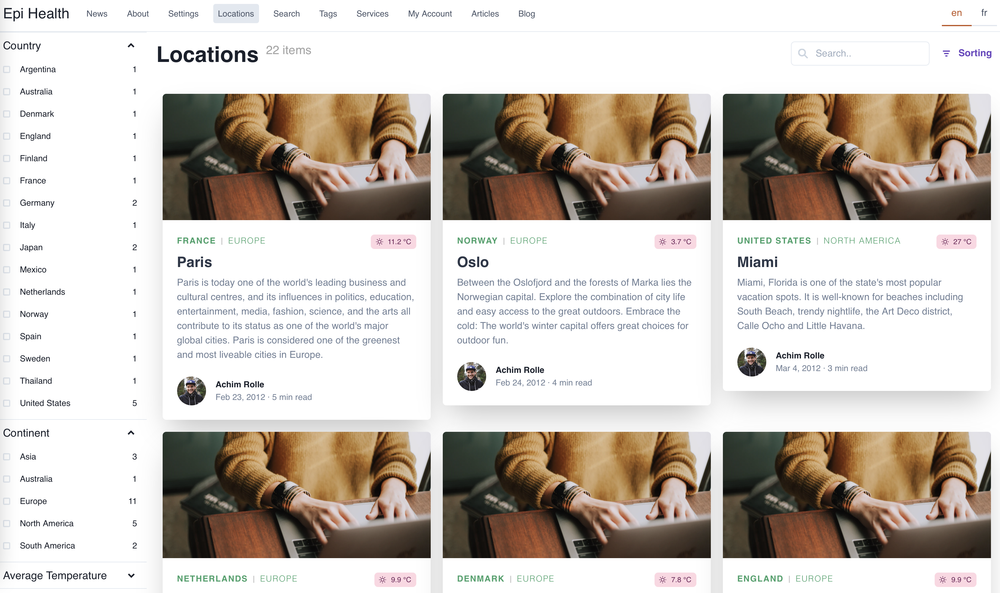
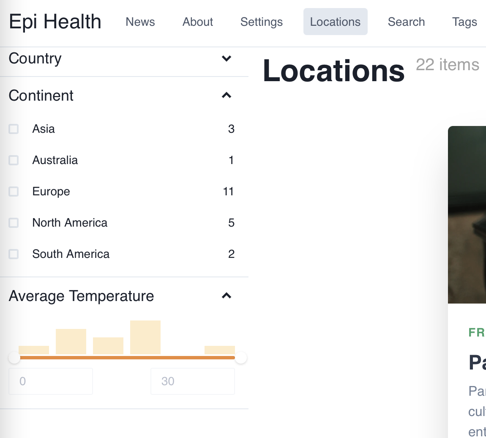

# LocationList page



## Overview

1. Query all location list pages.
2. Query all location items of each location page.
3. Get facets of `Country`, `Continents` and `AverageTemperature`
4. Create `LocationListPage` component



## Steps

1. Query all location list pages

```gql
query LocationListQuery(
  $locale: [Locale] = [EN]
  $path: String
  $continents: [String] = []
  $countries: [String] = []
  $minAvgTemp: Float = 0
  $maxAvgTemp: Float = 30
  $orderBy: LocationItemPageOrderByInput
  $searchTerm: String = ""
) {
  LocationListPage(locale: $locale, where: { RelativePath: { eq: $path } }) {
    items {
      Name
      MainBody
    }
  }
}
```

2. Query all location items of each location page.

```gql
query LocationListQuery(
  $locale: [Locale] = [EN]
  $path: String
  $continents: [String] = []
  $countries: [String] = []
  $minAvgTemp: Float = 0
  $maxAvgTemp: Float = 30
  $orderBy: LocationItemPageOrderByInput
  $searchTerm: String = ""
) {
  LocationListPage(locale: $locale, where: { RelativePath: { eq: $path } }) {
    items {
      Name
      MainBody
      _children {
        LocationItemPage(
          limit: 100
          where: {
            AvgTemp: { gte: $minAvgTemp, lte: $maxAvgTemp }
            Country: { in: $countries }
            Continent: { in: $continents }
            _fulltext: { like: $searchTerm }
          }
          orderBy: $orderBy
        ) {
          total
          items {
            Location: Name
            Country
            Continent
            Created
            AvgTemp
            Longitude
            Latitude
            IntroText: MainIntro
            RelativePath
          }
        }
      }
    }
  }
}
```

3. Refactor: move all fields under `LocationItemPage` items to a fragment.

```gql
fragment LocationItemFragment on LocationItemPage {
  Location: Name
  Country
  Continent
  Created
  AvgTemp
  Longitude
  Latitude
  IntroText: MainIntro
  RelativePath
}
```

The new code should be:

```gql
#import "./fragments/LocationItemFragment.gql"

query LocationListQuery(
  $locale: [Locale] = [EN]
  $path: String
  $continents: [String] = []
  $countries: [String] = []
  $minAvgTemp: Float = 0
  $maxAvgTemp: Float = 30
  $orderBy: LocationItemPageOrderByInput
  $searchTerm: String = ""
) {
  LocationListPage(locale: $locale, where: { RelativePath: { eq: $path } }) {
    items {
      Name
      MainBody
      _children {
        LocationItemPage(
          limit: 100
          where: {
            AvgTemp: { gte: $minAvgTemp, lte: $maxAvgTemp }
            Country: { in: $countries }
            Continent: { in: $continents }
            _fulltext: { like: $searchTerm }
          }
          orderBy: $orderBy
        ) {
          total
          items {
            ...LocationItemFragment
          }
        }
      }
    }
  }
}
```

4. Get facets of `Country`, `Continent` and `AverageTemperature` for `LocationItemPage`.

```gql
#import "./fragments/LocationItemFragment.gql"

query LocationListQuery(
  $locale: [Locale] = [EN]
  $path: String
  $continents: [String] = []
  $countries: [String] = []
  $minAvgTemp: Float = 0
  $maxAvgTemp: Float = 30
  $orderBy: LocationItemPageOrderByInput
  $searchTerm: String = ""
) {
  LocationListPage(locale: $locale, where: { RelativePath: { eq: $path } }) {
    items {
      Name
      MainBody
      _children {
        LocationItemPage(
          limit: 100
          where: {
            AvgTemp: { gte: $minAvgTemp, lte: $maxAvgTemp }
            Country: { in: $countries }
            Continent: { in: $continents }
            _fulltext: { like: $searchTerm }
          }
          orderBy: $orderBy
        ) {
          total
          items {
            ...LocationItemFragment
          }
          facets {
            Country(orderType: VALUE, orderBy: ASC, limit: 100) {
              name
              count
            }
            Continent(orderType: VALUE, orderBy: ASC) {
              name
              count
            }
            AverageTemperature: AvgTemp(
              ranges: [
                { from: 0, to: 5 }
                { from: 5, to: 10 }
                { from: 10, to: 15 }
                { from: 15, to: 20 }
                { from: 20, to: 25 }
                { from: 25, to: 30 }
              ]
            ) {
              name
              count
            }
          }
        }
      }
    }
  }
}
```

The above query returns the below data:

```json
{
  "data": {
    "LocationListPage": {
      "items": [
        {
          "Name": "Locations",
          "MainBody": "",
          "_children": {
            "LocationItemPage": {
              "total": 22,
              "items": [
                {
                  "Location": "Paris",
                  "Country": "France",
                  "Continent": "Europe",
                  "Created": "2012-02-23T09:16:00Z",
                  "AvgTemp": 11.2,
                  "Longitude": 2.3508,
                  "Latitude": 48.8567,
                  "IntroText": "Paris is today one of the world's leading business and cultural centres, and its influences in politics, education, entertainment, media, fashion, science, and the arts all contribute to its status as one of the world's major global cities. Paris is considered one of the greenest and most liveable cities in Europe.",
                  "RelativePath": "/en/locations/Paris",
                  "__typename": "LocationItemPage"
                },
                {
                  "Location": "Oslo",
                  "Country": "Norway",
                  "Continent": "Europe",
                  "Created": "2012-02-24T08:28:00Z",
                  "AvgTemp": 3.7,
                  "Longitude": 10.756389,
                  "Latitude": 59.949444,
                  "IntroText": "Between the Oslofjord and the forests of Marka lies the Norwegian capital. Explore the combination of city life and easy access to the great outdoors. Embrace the cold: The world's winter capital offers great choices for outdoor fun.",
                  "RelativePath": "/en/locations/Oslo",
                  "__typename": "LocationItemPage"
                },
                ...
              ],
              "facets": {
                "Country": [
                  {
                    "name": "Argentina",
                    "count": 1,
                    "__typename": "StringFacet"
                  },
                  ....
                  {
                    "name": "United States",
                    "count": 5,
                    "__typename": "StringFacet"
                  }
                ],
                "Continent": [
                  {
                    "name": "Asia",
                    "count": 3,
                    "__typename": "StringFacet"
                  },
                  ...
                  {
                    "name": "South America",
                    "count": 2,
                    "__typename": "StringFacet"
                  }
                ],
                "AverageTemperature": [
                  {
                    "name": "[,5)",
                    "count": 2,
                    "__typename": "NumberFacet"
                  },
                  {
                    "name": "[5,10)",
                    "count": 6,
                    "__typename": "NumberFacet"
                  },
                  {
                    "name": "[10,15)",
                    "count": 4,
                    "__typename": "NumberFacet"
                  },
                  {
                    "name": "[15,20)",
                    "count": 8,
                    "__typename": "NumberFacet"
                  },
                  {
                    "name": "[20,25)",
                    "count": 0,
                    "__typename": "NumberFacet"
                  },
                  {
                    "name": "[25,30)",
                    "count": 2,
                    "__typename": "NumberFacet"
                  }
                ],
                "__typename": "LocationItemPageFacet"
              },
              "__typename": "LocationItemPageOutput"
            },
            "__typename": "QueryRef"
          },
          "__typename": "LocationListPage"
        }
      ],
      "__typename": "LocationListPageOutput"
    }
  },
  "extensions": {
    "correlationId": "94db1ed2-79ce-47bc-91b6-16b3a08f3b1c"
  }
}
```

5. Create LocationListPage component.

Now, you got the data you want, you can create a LocationListPage component as a view to show this data. The code is quite long, so please refer to the folder `client/components/page/LocationListPage/index.tsx`.
